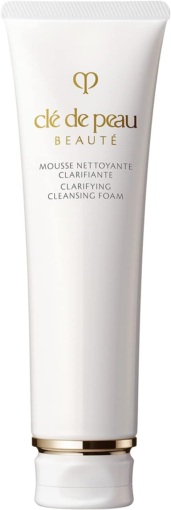

# amazon-affiliate-autopilot

End-to-end pipeline that turns Amazon affiliate products into AI talking-head YouTube Shorts — one consistent host, one product per video, affiliate link in the description.

Each pipeline stage is a slash-command skill — idempotent, manifest-driven, and accepts a single slug, a comma-list, or `--all-needing`.

## Pipeline

| # | Stage | Skill / tool | Visual |
|---|---|---|---|
| 1 | **Character refs** — pin a host face + voice per channel | manual `characters/<channel>/` |    |
| 2 | **Scrape Amazon** — link + product details + main image | `amazon-product-page-scraper/` (Chrome ext) |  |
| 3 | **Starting frame** — Hedra image-gen, 9:16 lifestyle composite | `/generate-starting-image` |  |
| 4 | **Narration script** — 15–20s podcast-tone voiceover | `/write-script` | _"Listen, your cleanser matters way more than people give it credit for. The Clé de Peau Beauté Clarifying Cleansing Foam — made in Japan, built around their Skin Intelligence research that's been their signature for over forty years. Clears the day off without that tight, stripped feeling. An affordable luxury, honestly. Tap the link to grab it on Amazon."_ |
| 5 | **Narration audio** — ElevenLabs TTS, channel voice pinned | `/generate-narration` | <video src="https://github.com/matthewmiglio/amazon-affiliate-autopilot/raw/master/docs/readme-assets/05-narration.mp3" controls></video> |
| 6 | **UGC talking head** — starting image + narration → Hedra Avatar | `/generate-hedra-video` | <video src="https://github.com/matthewmiglio/amazon-affiliate-autopilot/raw/master/docs/readme-assets/06-raw-speaker-video.mp4" controls width="240"></video> |
| 7 | **Audio restitch** — swap Hedra's baked audio for the clean local mp3 | `/stitch-narration` (ffmpeg) | <video src="https://github.com/matthewmiglio/amazon-affiliate-autopilot/raw/master/docs/readme-assets/07-stitched-narration.mp4" controls width="240"></video> |
| 8 | **Captions** — WhisperX word-level + auto-picked style preset | `/caption-video` | <video src="https://github.com/matthewmiglio/amazon-affiliate-autopilot/raw/master/docs/readme-assets/08-captioned-video.mp4" controls width="240"></video> |
| 9 | **Background music** — ducked random track from `music/` library | `/overlay-music` | <video src="https://github.com/matthewmiglio/amazon-affiliate-autopilot/raw/master/docs/readme-assets/09-final-with-music.mp4" controls width="240"></video> |
| 10 | **Upload** — YouTube Shorts via multi-channel OAuth | `/upload-ad` | Posted Short — affiliate link in first line of description, paid-promotion toggle ON |

## Layout

| Path | Purpose |
|---|---|
| `characters/` | Per-channel character refs + pinned voice (the host identity) |
| `amazon-product-page-scraper/` | Chrome extension — scrapes Amazon product pages into manifests |
| `products/` | Per-product folders — manifest + all generated media (gitignored) |
| `hedra-vid-gen/` | Hedra API client — starting-image + avatar-video generation |
| `narration/` | ElevenLabs TTS generation |
| `captioning/` | WhisperX transcription + word-level caption renderer + style presets |
| `music/` | Background music library (`<adjective>-<animal>.mp3`) |
| `scripts/` | Per-stage CLIs: import_music, stitch_narration, overlay_music, upload_ad, status |
| `uploader/` | Multi-channel YouTube OAuth + upload CLI |
| `.claude/skills/` | Slash-command wrappers for every pipeline stage |
| `docs/` | Channel strategy, niche, compliance rules |

## Stack

- **Starting frame + talking head:** Hedra (image-gen + Character-3 avatar)
- **TTS:** ElevenLabs Turbo v2.5 (channel voice pinned per character)
- **Audio restitch:** ffmpeg (swap Hedra's baked audio for the clean ElevenLabs mp3)
- **Captions:** WhisperX word-level transcription + local caption renderer with auto-picked style presets
- **Background music:** local `music/` library, ducked under narration
- **Upload:** YouTube Data API via `uploader/upload.py`

## Compliance

- Every description: "As an Amazon Associate I earn from qualifying purchases."
- YouTube "paid promotion" toggle ON for every Short
- Affiliate link in the first line of the description (Shorts can't link in-video)
- Channel must stay public
