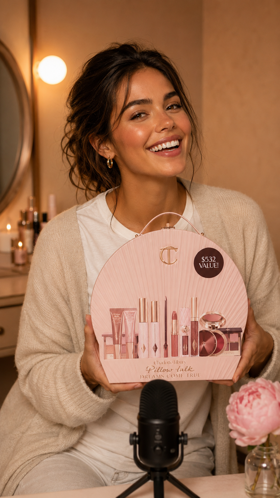
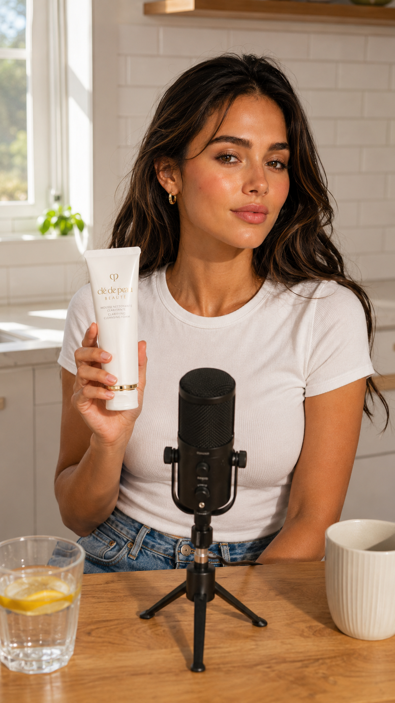
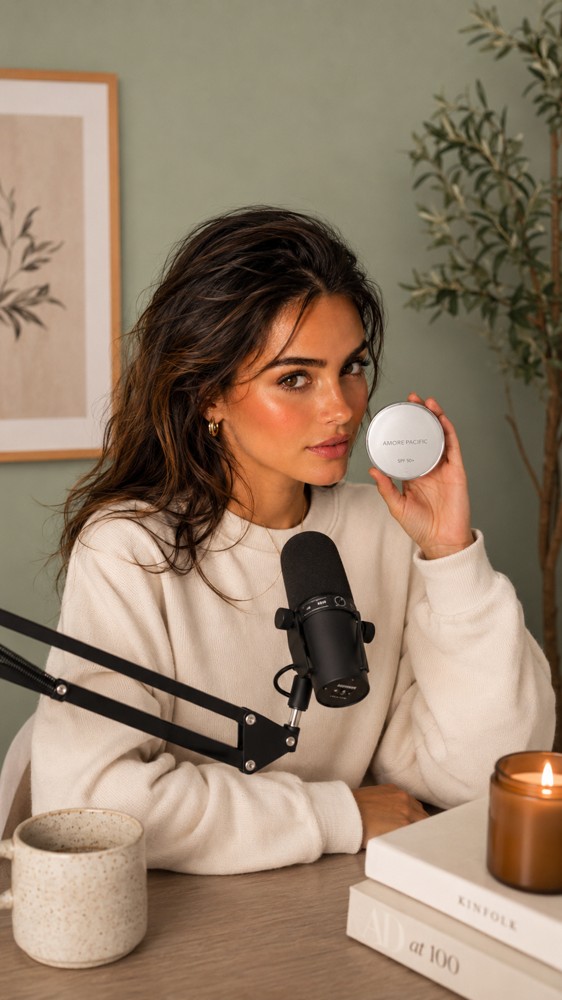

# amazon-affiliate-autopilot

Pipeline that picks Amazon products, generates AI talking-head YouTube Shorts, and uploads them with affiliate links — end-to-end, hands-off.

## The Character

A consistent AI-generated host fronts every Short. Same face, same voice, different products — so the channel feels like a single creator instead of a content farm.

<p align="center">
  
  
  
</p>

## Lifestyle Scenes

Each product gets dropped into a lifestyle composite — kitchen, vanity, desk — so the Short looks like a real recommendation, not a stock listing.

<p align="center">
  
  
  
</p>

## Pipeline

```
Amazon product page
    ↓ amazon-product-page-scraper (Chrome extension)
products/<slug>/manifest.json
    ↓ scripts/apply_scripts.py  (15–20s narration)
    ↓ ElevenLabs TTS
narration.mp3
    ↓ Hedra Character-3  (image + audio → talking head)
talking-head.mp4  (9:16, lip-synced)
    ↓ HyperFrames + captioning/
final-short.mp4  (captions, branding, B-roll)
    ↓ uploader/upload.py
Posted YouTube Short  (affiliate link in description)
```

## Layout

| Path | Purpose |
|---|---|
| `amazon-product-page-scraper/` | Chrome extension that scrapes product pages → `manifest.json` |
| `docs/` | Channel strategy, niche, video pipeline, compliance rules |
| `scripts/` | Narration script generator, linter, status dashboard |
| `narration/` | TTS audio generation |
| `captioning/` | Whisper transcription + caption render |
| `uploader/` | Multi-channel YouTube OAuth + upload CLI |
| `products/` | Per-product folders (gitignored — large media) |

## Status

Pre-Associates approval. Need a YouTube channel with 8–10 Shorts posted before applying.

1. Pick a niche (see `docs/niche.md`)
2. Set up channel — name, handle, banner, description
3. Generate 8–10 Shorts before applying
4. Apply with the channel URL listed
5. Replace placeholder links with tagged affiliate URLs once approved
6. Hit 3 qualifying sales within 180 days to keep the account active

## Stack

- **Talking head:** Hedra Character-3 (image + audio → lip-synced 9:16, ~$0.30–$0.90/Short)
- **TTS:** ElevenLabs Turbo v2.5 (~$0.03/Short)
- **B-roll:** Kling 2.6 for non-dialogue motion clips
- **Compositing/captions:** HyperFrames
- **Upload:** YouTube Data API via `uploader/`

See `docs/video-pipeline.md` for cost breakdown and provider comparison.

## Compliance

- Every description: "As an Amazon Associate I earn from qualifying purchases."
- YouTube "paid promotion" toggle ON for every Short
- Affiliate link in the first line of the description (Shorts can't link in-video)
- Channel must stay public
